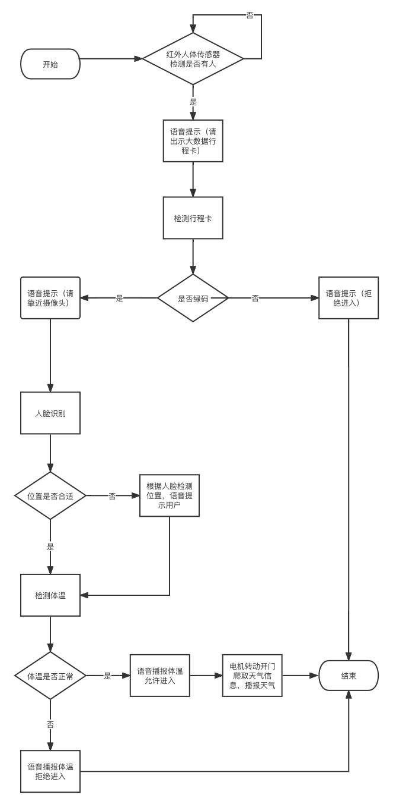
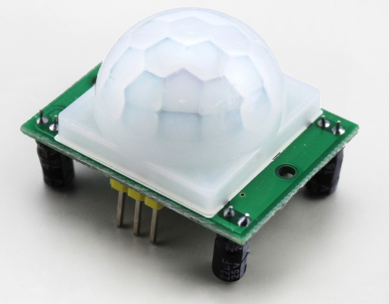
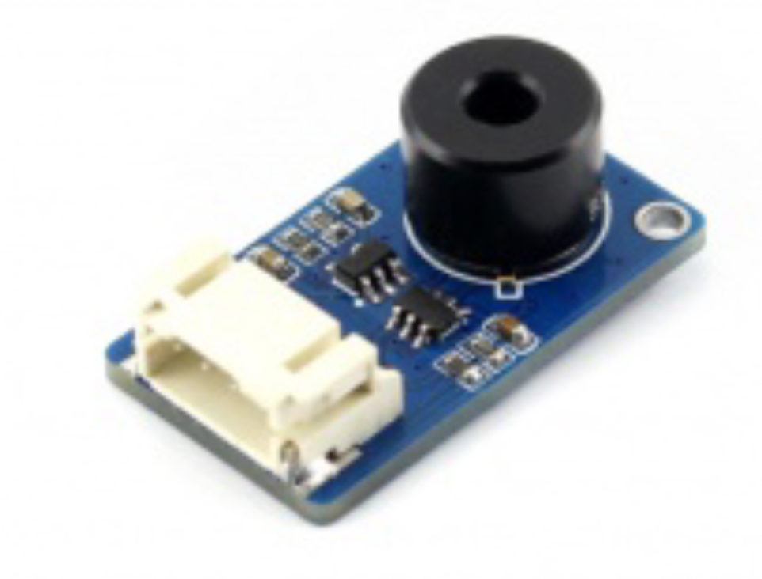
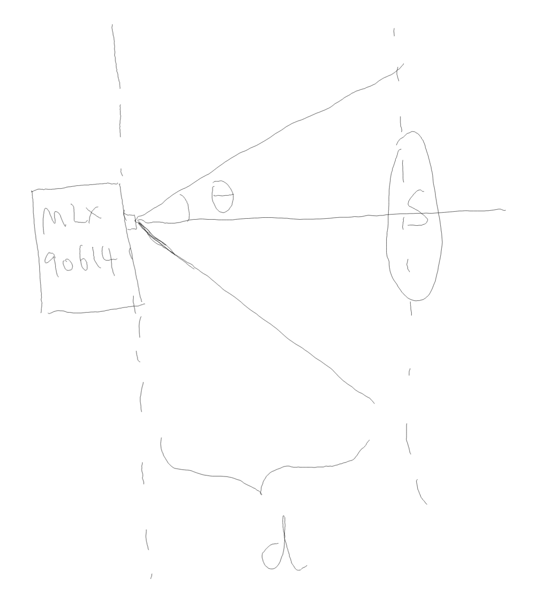
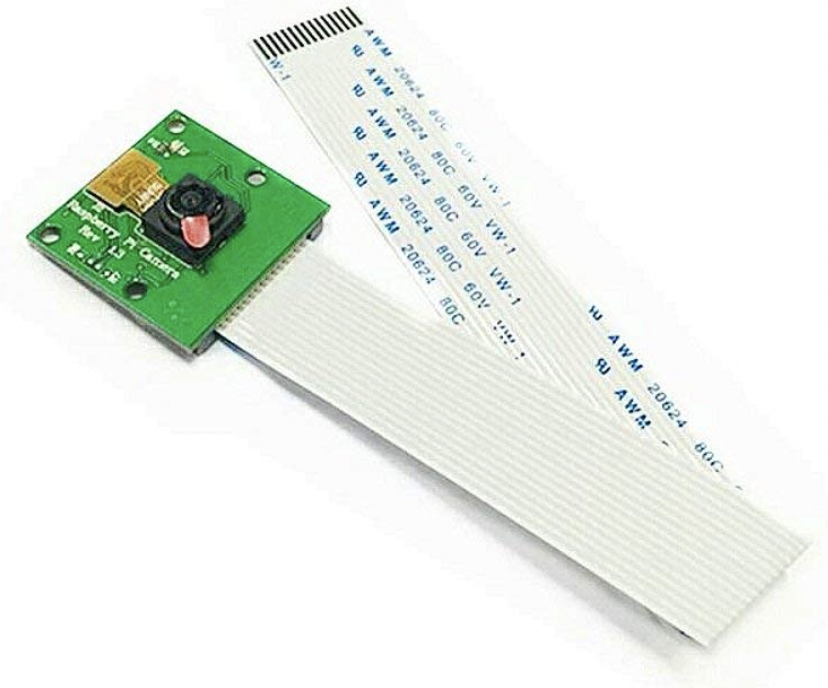
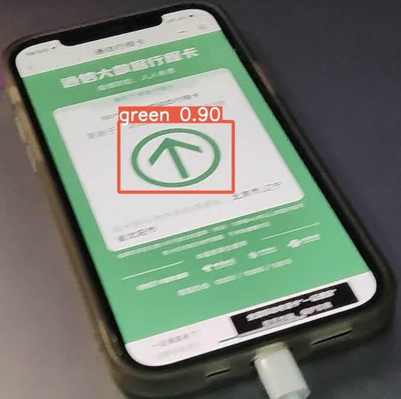
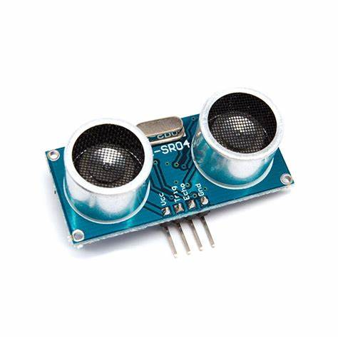

# 基于树莓派3B的疫情防控机器人


### 1. 概述




<center>
开发的嵌入式疫情防控机器人</center>

运用人体红外感应传感器（HC-SR501）检测人体，红外测温传感器（MLX90614）为人体测温，CSI串口的摄像头检测人脸及大数据行程卡是否绿卡，为精准、科学疫情防控助力。还设计了测温传感器的温度补偿算法，用超声波测距传感器（HC-SR04）测量机器与人的距离，来补偿距离过远，造成不能完全覆盖视场导致温度不准的问题（详见2.2.3）。

### 2. 传感器

下面我将阐释我对我用到的这几款传感器的学习体会。

#### 2.1 人体红外感应传感器（HC-SR501）



##### 2.1.1 工作原理

人体保持约37度体温，发出大约10微米波长的红外线。HC-SR501传感器通过菲涅尔透镜聚焦这些红外线至红外感应元件，该元件利用热释电效应在电极间产生电荷，从而将人体的移动转换为电信号。
##### 2.1.2 功能介绍

本传感器具有两种跳线方式，我在使用时采用了不重复触发的接线方式，作为疫情防控小车主程序的开关，在检测到人体之后才会开始工作。两种触发方式如下：

* 不可重复触发方式:即感应输出高电平后，延时时间段一结束，输出将自动从高电平变成低电平；
* 可重复触发方式：即感应输出高电平后，在延时时间段内，如果有人体在其感应范围活动，其输出将一直保持高电平，直到人离开后才延时将高电平变为低电平。（感应模块检测到人体的每一次活动后会自动顺延一个延时时间段，并且以最后一次活动的时间为延时时间的起始点)


#### 2.2 红外测温传感器（MLX90614）



##### 2.2.1 工作原理

红外测温器通过测量物体表面的红外辐射来确定其温度。该设备包括光学系统、光电探测器、信号放大器和处理系统。光学系统聚集目标的红外辐射，光电探测器将其转化为电信号，经放大和处理后输出温度值。其中，81101热电元件用于感应红外线，输出电压为：

```math
Vir = A(T_o^4 + T_a^4)
```
##### 2.2.2 功能介绍

利用SMbus接口通信，传输数据，对环境温度和视场内温度进行检测，将外部信号（温度）转化为可供后续处理的电信号。

##### 2.2.3 温度补偿算法

在测温过程中，实际是计算“视场”内点的平均值。所以当被测物体完全覆盖FOV视场时的准确度是最高的。

然而在对人脸测温的过程中，因为人脸可能距离测温传感器较远，导致没有完全覆盖其视场，使得视场内很多点的温度实际是环境温度，致使测量的温度不准确。所以我设计了如下的温度补偿算法：



使用距离传感器测量MLX90614与人脸的距离 \(d\)，已知视场角为 \(2\theta\)，人脸的大概大小为 \(S\)。测出来的环境温度为 \(T_{\text{环}}\)，测出的视场内的平均温度为 \(T_{\text{测}}\)，估计的人脸温度为 \(T_{\text{脸}}\)，可以得到如下温度对应关系：

给定测量温度 \(T_{\text{测}}\)，环境温度 \(T_{\text{环}}\) 和传感器的特定参数，我们有：


```math
\pi (\tan \theta \cdot d)^2 \cdot T_{\text{测}} = S \cdot T_{\text{脸}} + \left(\pi (\tan \theta \cdot d)^2 - S\right) \cdot T_{\text{环}}
```

这样可以尽量减少距离较远导致对视场覆盖不足的影响。但是由于疫情原因快递停运，未能买到超声波距离传感器，导致这个算法只存在于设计阶段，未能真正实现，实在是非常可惜。


#### 2.3 CSI摄像头



##### 2.3.1 工作原理

我使用的这款CSI串口的摄像头采用了索尼IMX219光学传感器。是一款CMOS作为感光元件的摄像头，具有低成本、低功耗、以及高整合度的特点。


##### 2.3.2 实现功能

传回电信号，即图片后，用机器学习目标检测算法，提前训练好的yolov5模型对健康码、人脸等进行检测。效果如下：



从而保证只有未去过高风险地区的健康码为绿码的人，才可以通行。如果能连接政府的公民数据库，也可以对辽视通健康码进行检测，解析二维码后得到公民信息，从而对到访、经过人员进行登记，保证后续流调的顺利进行。

#### 2.4 超声波测距传感器



计划使用HC-SR04进行机器与人脸的距离测量，实现上面2.2.3所说的温度补偿算法。

##### 2.4.1 工作原理

人声频率在100Hz至8kHz，而20kHz以上为超声波，直线传播且高频绕射弱、反射强。HC-SR04传感器可以发送和接收超声波：

* 发射：施加电压使压电元件形变，通过压电逆效应发送超声波。
* 接收：通过压电效应将接收到的超声波转化为电信号，后通过放大器放大。
##### 2.4.2 实现功能

测量机器和人之间的距离，为红外测温传感器做温度补偿。

